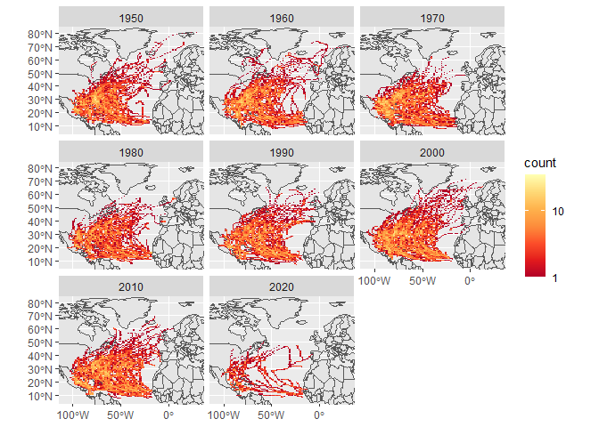

Case Study 09
================
Weishan Bai
11/01/2020

# read data

``` r
dataurl="https://www.ncei.noaa.gov/data/international-best-track-archive-for-climate-stewardship-ibtracs/v04r00/access/shapefile/IBTrACS.NA.list.v04r00.points.zip"
tdir=tempdir()
download.file(dataurl,destfile=file.path(tdir,"temp.zip"))
unzip(file.path(tdir,"temp.zip"),exdir = tdir)
list.files(tdir)
```

    ## [1] "file211458a988"                    "file21147f1c3942"                 
    ## [3] "IBTrACS.NA.list.v04r00.points.dbf" "IBTrACS.NA.list.v04r00.points.prj"
    ## [5] "IBTrACS.NA.list.v04r00.points.shp" "IBTrACS.NA.list.v04r00.points.shx"
    ## [7] "temp.zip"

``` r
storm_data <- read_sf(list.files(tdir,pattern=".shp",full.names = T))
```

# Wrangle the data

``` r
data_na<-storm_data %>% filter(BASIN == "NA")
storm<-data_na%>%filter(SEASON>=1950)%>%mutate_if(is.numeric, function(x) ifelse(x==-999.0,NA,x)) %>%
  mutate(decade=(floor(year/10)*10))
region<-storm%>%st_bbox()
```

# Make the first plot

<!-- -->

# show the table

<table class="table table-striped" style="margin-left: auto; margin-right: auto;">

<thead>

<tr>

<th style="text-align:left;">

state

</th>

<th style="text-align:right;">

storm1

</th>

</tr>

</thead>

<tbody>

<tr>

<td style="text-align:left;">

Florida

</td>

<td style="text-align:right;">

83

</td>

</tr>

<tr>

<td style="text-align:left;">

North Carolina

</td>

<td style="text-align:right;">

62

</td>

</tr>

<tr>

<td style="text-align:left;">

Georgia

</td>

<td style="text-align:right;">

57

</td>

</tr>

<tr>

<td style="text-align:left;">

Texas

</td>

<td style="text-align:right;">

53

</td>

</tr>

<tr>

<td style="text-align:left;">

Louisiana

</td>

<td style="text-align:right;">

49

</td>

</tr>

</tbody>

</table>
