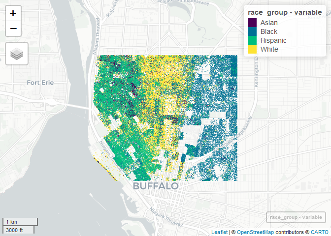

Case Study 11
================
Weishan Bai
Nov 12, 2020

``` r
library(tidyverse)
```

    ## -- Attaching packages --------------------------------------- tidyverse 1.3.0 --

    ## √ ggplot2 3.3.2     √ purrr   0.3.4
    ## √ tibble  3.0.4     √ dplyr   1.0.2
    ## √ tidyr   1.1.2     √ stringr 1.4.0
    ## √ readr   1.4.0     √ forcats 0.5.0

    ## -- Conflicts ------------------------------------------ tidyverse_conflicts() --
    ## x dplyr::filter() masks stats::filter()
    ## x dplyr::lag()    masks stats::lag()

``` r
library(spData)
library(sf)
```

    ## Linking to GEOS 3.8.0, GDAL 3.0.4, PROJ 6.3.1

``` r
## New Packages
library(mapview) # new package that makes easy leaflet maps
library(foreach)
```

    ## 
    ## Attaching package: 'foreach'

    ## The following objects are masked from 'package:purrr':
    ## 
    ##     accumulate, when

``` r
library(doParallel)
```

    ## Loading required package: iterators

    ## Loading required package: parallel

``` r
registerDoParallel(4)
getDoParWorkers() # check registered cores
```

    ## [1] 4

``` r
library(tidycensus)
census_api_key("c897a3f3ef723e7bb02fbaf3adf4a2f20aadd380")
```

    ## To install your API key for use in future sessions, run this function with `install = TRUE`.

``` r
racevars <- c(White = "P005003", 
              Black = "P005004", 
              Asian = "P005006", 
              Hispanic = "P004003")

options(tigris_use_cache = TRUE)
erie <- get_decennial(geography = "block", variables = racevars, 
                  state = "NY", county = "Erie County", geometry = TRUE,
                  summary_var = "P001001", cache_table=T) 
```

    ## Getting data from the 2010 decennial Census

    ## Using Census Summary File 1

``` r
extent<- c(xmin=-78.9,xmax=-78.85,ymin=42.888,ymax=42.92)
crop_erie = st_crop(erie,extent)
index = unique(as.factor(crop_erie$variable))
race_group <- foreach(i=1:4, .combine='rbind',.packages = c("tidyverse","sf")) %dopar% {
  
  crop_erie %>%
    filter(variable == index[i]) %>%
    st_sample(size=.$value) %>%
    st_as_sf() %>%
    mutate(variable=index[i])
}
mapview(race_group, zcol="variable", cex=1, lwd=0)
```

<!-- -->
